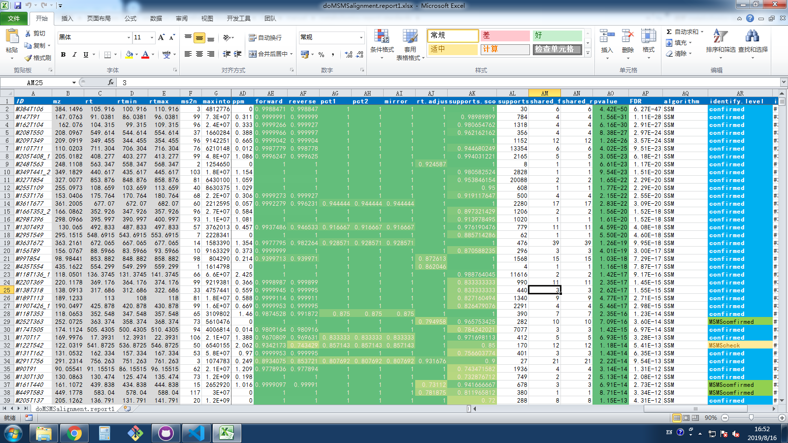
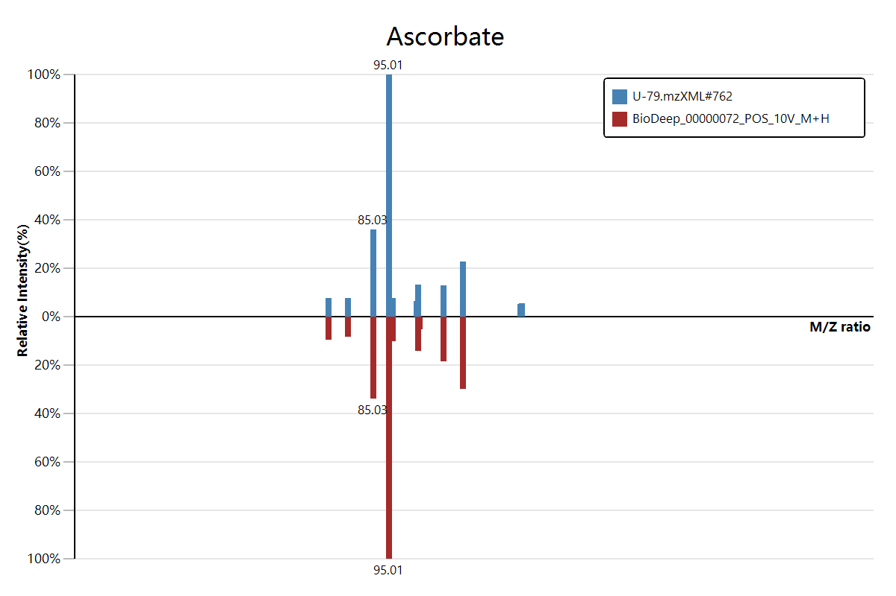

# Metabolomics Identification Report Standards Version 2

*A Metabolomics unknown feature identification report industry standards from [BioNovoGene](http://www.bionovogene.com/) corporation.*

_#2019.08.16#_ at Suzhou, China 

Table of Content

<!-- vscode-markdown-toc -->
* 1. [Definition and background](#Definitionandbackground)
* 2. [Report Table Format](#ReportTableFormat)
	* 2.1. [section1: basic info of ion feature](#section1:basicinfoofionfeature)
	* 2.2. [section2: annotation information](#section2:annotationinformation)
		* 2.2.1. [part1. the basic meta information](#part1.thebasicmetainformation)
		* 2.2.2. [part2. the external database cross reference id](#part2.theexternaldatabasecrossreferenceid)
		* 2.2.3. [part3. the chemical structure information of target](#part3.thechemicalstructureinformationoftarget)
	* 2.3. [section3: annotation score](#section3:annotationscore)
* 3. [Alignment Visual](#AlignmentVisual)
* 4. [Supplementary](#Supplementary)

<!-- vscode-markdown-toc-config
	numbering=true
	autoSave=true
	/vscode-markdown-toc-config -->
<!-- /vscode-markdown-toc -->

##  1. Definition and background

There is a general consensus that supports the need for standardized reporting of metadata or information describing large-scale metabolomics data sets. Reporting of standard metadata provides a biological and empirical context for the data, enables the reinterrogation and comparison of data by others, which is also could let us interpret the result in a more clearly way.

This article is mainly address at the unknown metabolite identification in LC-MS experiment, and proposes the reporting standards related to the chemical analysis aspects of metabolomics experiments its metabolite identification.

Some terms in this article that address to:

+ ``feature``, the term **feature** in this article is refer to a parent ion in LC-MS experiment result raw data. Where a parent ion feature is a peak in chromatography data, which is consist of mass to charge ratio in ms1 level and its retention time (with a range of lower bound and upper bound) in chromatography experiment result.
+ ``annotation``, the term **annotation** in this article is refer to the multidimensional information about the metabolite that assigned to a unknown **feature**, which such multidimensional information consist with the metabolite its cross reference id in different database, common name, basic chemical data like mass and formula composition and its molecule structure information, etc. 
+ ``alignment``, the term **alignment** means a kind of operation that use to compare the similarity of the mass spectrum data between user sample and the reference standard library. Such similarity comparison result is the most important evidence that use for unknown **feature** its identification.
+ ``score``, the term **score** is a kind of numeric value that produced by the **alignment** comparison calculation. Literally, the higher score the **alignment** it produce, the better the result it is.

Our metabolite identification report consist with two parts of data which present to our user:

1. Report excel table that contains the raw sample information and the meta annotation information of the metabolite.
2. Data visual plot for the mass spectrum alignment details.

##  2. Report Table Format

###  2.1. section1: basic info of ion feature

| field   | type    | description                                                                                      |
|---------|---------|--------------------------------------------------------------------------------------------------|
| ID      | name    | The unique id of current ion, which can be generated from ``xcms`` R package                     |
| mz      | double  | ``m/z`` ratio of the ion in ms1 result                                                           |
| mzmin   | double  | lower bound of the ``m/z`` ratio                                                                 |
| mzmax   | double  | upper bound of the ``m/z`` ratio                                                                 |
| rt      | double  | rt in seconds of the ion in liquid chromatography result                                         |
| rtmin   | double  | rt its lower bounds of the ion peaks                                                             |
| rtmax   | double  | rt its upper bounds of the ion peaks                                                             |
| ms2n    | integer | Number of ms/ms spectrum that matched by current ms1 ion                                         |
| maxinto | double  | The max intensity of current ion between samples                                                 |
| index   | name    | The row index                                                                                    |
| feature | name    | The feature of the best ms/ms spectrum in raw file, in format like: ``rawfile_name#scan_number`` |

###  2.2. section2: annotation information

In this section, includes three parts of annotation information to describ the resulted metabolite.

####  2.2.1. part1. the basic meta information

| field      | type   | description                                                   |
|------------|--------|---------------------------------------------------------------|
| BioDeepID  | term   | A unique database reference id of current assigned metabolite |
| name       | name   | The common name of the assigned metabolite                    |
| exact_mass | double | The exact mass of the assigned metabolite                     |
| formula    | term   | The chemical formula of the assigned metabolite               |

####  2.2.2. part2. the external database cross reference id

| field     | type | description                                  |
|-----------|------|----------------------------------------------|
| KEGG      | term | The KEGG compound id                         |
| hmdb      | term | The HMDB main id                             |
| pubchem   | term | The pubchem compound id (not substrate id)   |
| chebi     | term | The chebi main id                            |
| CAS       | term | The CAS registry number                      |
| metlin    | term | The metlin metabolite id                     |
| Wikipedia | term | The wikipedia query term for this metabolite |
| mzCloud   | term | The mzCloud guid of this metabolite          |

####  2.2.3. part3. the chemical structure information of target

| field               | type | description                                                                                        |
|---------------------|------|----------------------------------------------------------------------------------------------------|
| InChIKey            | name | The hash key of the InChI calculate result                                                         |
| InChI               | name | The InChI identifier of the molecule structure of current metabolite                               |
| SMILES              | name | The SMILES string of the molecule structure of current metabolite                                  |
| kingdom             | term | The chemical structure classify result in *kingdom* level from ``ClassyFire`` database             |
| super_class         | term | The chemical structure classify result in *super class* level from ``ClassyFire`` database         |
| class               | term | The chemical structure classify result in *class* level from ``ClassyFire`` database               |
| sub_class           | term | The chemical structure classify result in *sub class* level from ``ClassyFire`` database           |
| molecular_framework | term | The chemical structure classify result in *molecular framework* level from ``ClassyFire`` database |

###  2.3. section3: annotation score

This section of data consist with two parts of information. First part of the information is the alignment information for the metabolite identification, includes: the reference standard source trace in the reference library, and multiple dimensions of the scores of current identification.

| field          | type   | description                                                                                                |
|----------------|--------|------------------------------------------------------------------------------------------------------------|
| libname        | name   | The best alignment its unique id in mass spectrum reference library                                        |
| library        | name   | The library name                                                                                           |
| lib.mz         | double | The m/z ratio value of the ion in reference library                                                        |
| precursor_type | term   | The ``precursor type`` calculation result base on the sample mz and the exact mass value                   |
| ppm            | score  | The ppm value between sample mz and target reference libibrary mz                                          |
| forward        | score  | The ``query vs reference`` SSM socre                                                                       |
| reverse        | score  | The ``reference vs query`` SSM score                                                                       |
| shared_forward | score  | The number of shared fragment in direction ``query vs reference``                                          |
| shared_reverse | score  | The number of shared fragment in direction ``reference vs query``                                          |
| pct1           | score  | The shared fragment ratio in direction ``query vs reference``                                              |
| pct2           | score  | The shared fragment ratio in direction ``reference vs query``                                              |
| mirror         | score  | The mirror score between query and reference                                                               |
| rt.adjust      | score  | The robust rt adjustment score between sample and reference                                                |
| supports       | score  | The spectrum alignment supports count of current metabolite cross over multiple standard spectrum database |
| supports.score | score  | The ratio of supports against the max likelihood supports score                                            |

And then, is the final identification confidence result for current alignment.

| field          | type    | description                                                                                                         |
|----------------|---------|---------------------------------------------------------------------------------------------------------------------|
| pvalue         | score   | The max likelihood hyper-geometric pvalue test result                                                               |
| FDR            | score   | FDR controls of the pvalue                                                                                          |
| FDR.flag       | boolean | the xyMeta FDR controls result                                                                                      |
| FDR.pros       | score   |                                                                                                                     |
| FDR.cons       | score   |                                                                                                                     |
| FDR.ratio      | score   |                                                                                                                     |
| algorithm      | enum    | The algorithm name for produce current identification score: ``SSM``/``shared_hits``/``metaDNA``                    |
| identify.level | enum    | The confidence level of current identification result: ``confirm``, ``MSMSconfirmed``, ``MSMScheck`` and ``ms2hit`` |
| MSI_levels     | enum    |                                                                                                                     |

The result of ``identify.level`` have literal values for the representation of the identification its confidence level(defined by BioNovoGene):

+ confirm: the unknown feature is *confirm* as the assigned metabolite both in ms1 level and ms2 level
+ MSMSconfirmed: the unknown feature is *confirm* as the assigned metabolite in ms2 level, and ms1 m/z ratio, but not match in rt relative adjustment result value.
+ MSMScheck: the unknown feature is probably *confirm* as the assigned metabolite in ms2 level and ms1 m/z ratio, but have low score in ms2 alignment and rt also not match.
+ ms2hit: the unknown feature is probably *confirm* as the assigned metabolite, but have low score in ms2 alignment and rt match, we only sure that the alignment have the relative high number of shared fragments between the user sample and the reference library.

The result of ``MSI_levels`` have literal values for the representation of the identification its confidence level:

+

##### Remarks

The 

> 1. ``SSM`` algorithm is original defined in this literature article: "MetDIA: Targeted Metabolite Extraction of Multiplexed MS/MS Spectra Generated by Data-Independent Acquisition." **_DOI: 10.1021/acs.analchem.6b02122_**
> 2. ``MetaDNA`` algorithm is original defined in the literature article: "Metabolic reaction network-based recursive metabolite annotation for untargeted metabolomics." **_DOI: 10.1038/s41467-019-09550-x_**
> 3. ``pvalue`` is tested from the ``BHR`` score vector, which is original defined in this literature article: "KAAS: an automatic genome annotation and pathway reconstruction server." **_DOI: 10.1093/nar/gkm321_**
> 4. ``FDR.ratio`` or ``FDR.flag`` is the ``xyMeta`` algorithm result for . which is : "XY-Meta: A high-efficiency search engine for large scale metabolome annotation with accurate FDR estimation." **_DOI: 10.1021/acs.analchem.9b03355_**
> 5. ``rt.adjust`` is the score result of the scalable chromatography mapping result, which is generated by a machine learning method from the literature article: . The method is laterly improved in BioNovoGene R&D labs.
> 6. ``MSI_levels`` "Proposed minimum reporting standards for chemical analysis". **_DOI: 10.1007/s11306-007-0082-2_** 
> 7. ``identify.level`` "Identifying Small Molecules via High Resolution Mass Spectrometry: Communicating Confidence". **_DOI: 10.1021/es5002105_**

##  3. Alignment Visual

Due to the reason of mass spectrum alignment is the most important part in unknown metabolite identification, so it is important to make a clear presentation of the alignment result to user. 

The mass to mass spectrum alignment reuslt can be visual by bi-direction barplot, where the top part of the plot which in blue is the ms2 mass spectrum in user sample; and the bottom half of the plot which in brown color is the ms2 mass spectrum of the reference in standards library.

> Only the molecule fragment its intensity value greater than 30%, then its mz ratio will be display on this barplot. 

##  4. Supplementary

| item                             | url link                                                                                                                                               |
|----------------------------------|--------------------------------------------------------------------------------------------------------------------------------------------------------|
| **Free software and web server** | http://msms.biodeep.cn/                                                                                                                                |
| Commercial analysis services     | 0512-62959105 (market@bionovogene.com)                                                                                                                 |
| Download demo report table       | [github](https://github.com/BioDeep/metabolomics-report-standards/blob/a10485ad642ec1eafd6878b99b0033a75b8cee2e/doMSMSalignment.report1.xlsx?raw=true) |
| Demo alignment visual plots      | [View on github](https://github.com/BioDeep/metabolomics-report-standards/tree/3356a228489aaef80a8a16ee58e982262b6823ea/plots)                         |
